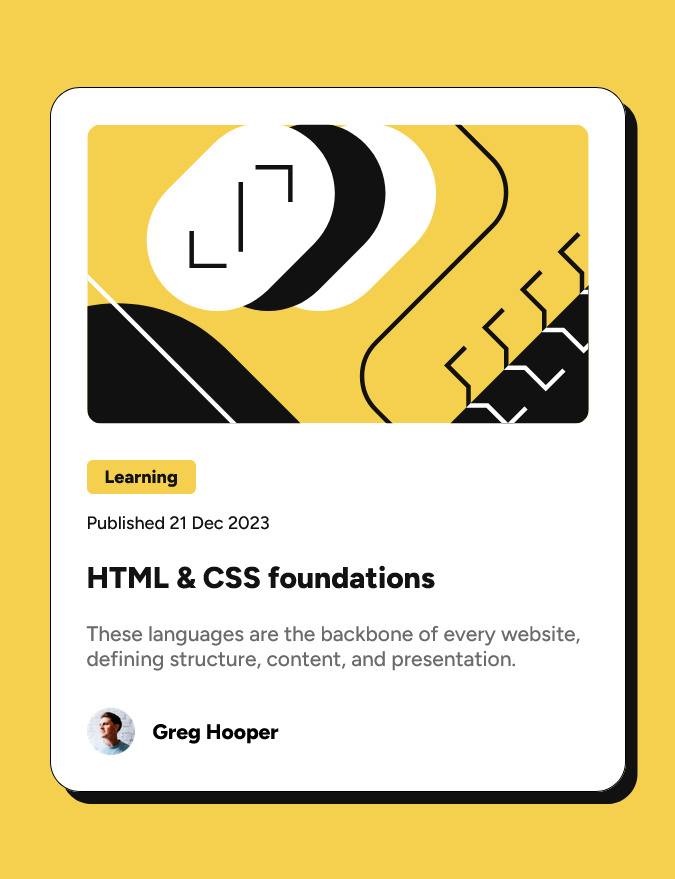

# Frontend Mentor - Blog preview card solution

This is a solution to the [Blog preview card challenge on Frontend Mentor](https://www.frontendmentor.io/challenges/blog-preview-card-ckPaj01IcS).
## Table of contents

- [Overview](#overview)
  - [The challenge](#the-challenge)
  - [Screenshot](#screenshot)
  - [Links](#links)
- [My process](#my-process)
  - [Built with](#built-with)
  - [What I learned](#what-i-learned)
  - [Continued development](#continued-development)
  - [Useful resources](#useful-resources)
  - [AI Collaboration](#ai-collaboration)
- [Author](#author)


## Overview

### The challenge

Users should be able to:

- See hover and focus states for all interactive elements on the page

### Screenshot




### Links

- Solution URL: [https://github.com/benkherouf1maria-cyber/Blog-preview-card](https://github.com/benkherouf1maria-cyber/Blog-preview-card)
- Live Site URL: [Add live site URL here](https://your-live-site-url.com)

## My process

### Built with

- Semantic HTML5 markup
- CSS custom properties
- Flexbox
- clamp() for controling font sizes through different screen widths

### What I learned
- I learned how to use figma , to know the exact paddings,margins, and be able to determine sections 
- I learned the font-face query , variable fonts, and the why behind them , its efficient to upload one file containing all weights than upload many for each weight a file 
- i learned how to declare a font-family for the .ttf font files

```css
@font-face {
    font-family: "Figtree";
    src: url("assets/fonts/Figtree-VariableFont_wght.ttf") format("truetype");
    font-weight: 100 900;
    font-style: normal;
}
```
- it is important to apply box-sizing:border-box to all elements rather than just body
- I learned how to target all children items of an item 
```css
.content > *{
.........
.etc
}
```
- To apply pseudo states like hover on active elements 
```css
.title:hover{
  color: hsl(47, 88%, 63%);

}
```

### Continued development

- flexbox
- css grid
- clamp() for controling font-size
- float 
- responsive design

### Useful resources

- [github copilot](https://github.com/copilot) - This showed me the clamp() function and its use ,reviewed my code and guided me to correct and better write my code I really liked this pattern and will use it going forward.
- [web dev](https://web.dev/articles/variable-fonts) - This is an amazing article which helped me finally understand variable fonts. I'd recommend it to anyone still learning this concept.


### AI Collaboration

- the tool I used is GitHub Copilot chat
- i wrote all the code my self then used it only to review and suggest better solution and it introduced me to the clamp() function for font sizes
- some of its suggestions worked what did not is the suggestion to make the content section display to flex with flex-direction set to column and gap to 12 px well it worked however it displayed all elements inside .content section as blocks which i did not want since category should be highlighted as an inline level element

## Author

- Website - [Benkherouf Maria](https://www.your-site.com)
- Frontend Mentor - [benkherouf1maria-cyber](https://www.frontendmentor.io/profile/benkherouf1maria-cyber)


